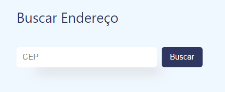
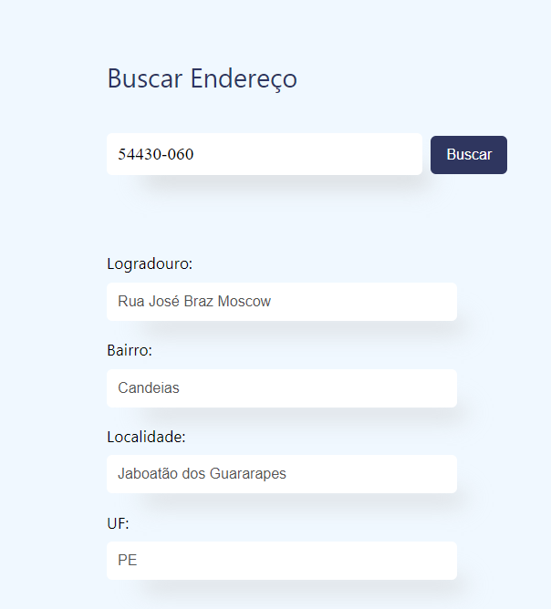

<h1 align="center"> Busca CEP - Angular </h1>

## Descrição: 

Este projeto é uma aplicação em Angular para buscar informações de endereço com base no CEP informado no campo principal. 

## Funcionalidades

- Busca de endereço po CEP 
- Exibição de dados como logradouro, bairro, localidade e UF

## Como usar

1. Clone o repositório

git clone https://github.com/usuario/repositorio.git

2. Navegue até o diretório do projeto

cd repositorio

3. Instale as dependências

npm install 

4. Execute o projeto

ng serve